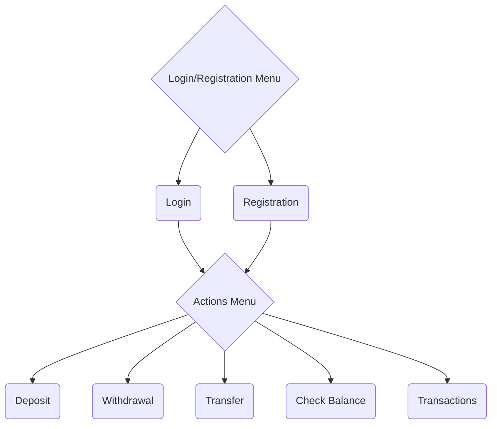

# ATM app

## Modules
1. Sign Up, Login
2. Deposit, Withdrawal
3. Check Balance
4. Transfer
5. Transactions

## Database Structure
1. Account
    - id
    - username
        - length 3-20
        - case-insensitive
        - alphabets, digits
    - password
        - length 8-20
        - case-sensitive
        - no whitespaces, no comma, no double quotes
    - name
        - length < 25
        - case-insensitive
        - alphabets, space, ', .
        - no whitespaces (other than space), no comma, no double quotes
3. Transactions
    - id
    - account_id
    - datetime
    - description: Withdrawal, Deposit, Transfered to <name>
    - amount (cr/dr)
    - balance

## UI Components
- Menu
- Forms
- Validation Errors
- Tables

## Journey

## Backend Handlers
- File Handling
    - create file
    - append to file
    - read lines from file
- Escaping commas and double quotes from data for csv format
- Database Management
    - create
    - insert
    - select
    - optional: update, aggregation
- optional: Hashing for Passwords

## CSV format
- every line is a record
- the first line can be a header
- records contain multiple fields which are separated by commas
- all records should contain the same sequence of fields
- data cannot contain line break or comma
- trim leading and trailing spaces
- use quotes to esacpe the line break, comma or leading/trailing spaces in the data
